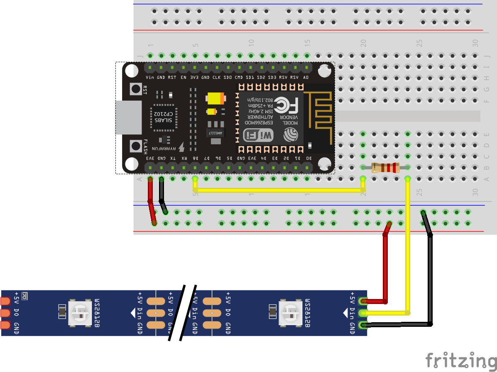

# LED Beispiele

Diese Beispielprogramme zeigen auf einfache Weise wie das Lichtband agesteuert werden kann

## LED Sample 1
In diesem einfachen Beispiel werden alle LED auf rot geschaltet, und ein heller roter Punkt wandert auf und ab.
## LED Sample 2
In der Erweiterung ändert sich die Farbe beim wandernden Punkt. Der wandernde Punkt hat nun eine grüne Farbe und ist breiter.
Es gibt nun einige Variablen, mit welchem Du das Verhalten der LEDs einfach verändern kannst:
* Länge der LED Kette
* Geschwindigkeit des wandernden Punktes
* Relative Breite des wandernden Punktes

## Bauteile
Du benötigst
- NodeMCU Board
- Widerstand ca 470Ohm
- WS2812 LED Band mit mindestens 10 LED

## Schaltplan
Der Bauteile wie folgt verbinden: 


## Code

Um die Lampenkette propgrammieren zu können sind falgende Anweisungen nötig.
Zuerst muss die Bibliothek eingebunden werden;

```c
#include <Adafruit_NeoPixel.h>
#ifdef __AVR__
 #include <avr/power.h> // Required for 16 MHz Adafruit Trinket
#endif
```

Jetzt muss definiert werden über welchen Pin am ESP12b das LED Band (WS2812B) verbunden ist.

```c
// auf dem ESP8266 ist der RX0 Pin die Nr 6
#define PIN    6
// Dann noch … wie viele LEDs stehen uns zur Verfügung? 
#define NUMPIXELS 16
// Setup der Adafruit_NeoPixel-Lib vor der Benutzung … 
Adafruit_NeoPixel pixels(NUMPIXELS, PIN, NEO_GRB + NEO_KHZ800);`
```

Die Setup Methode wird einmal am Anfang aufgerufen und initialisiert unter anderem die Adafruit_NeoPixel-Lib … 
```c
void setup() {
#if defined(__AVR_ATtiny85__) && (F_CPU == 16000000)
  clock_prescale_set(clock_div_1);
#endif
  Serial.begin(115200);
  pixels.begin();
}
```

Jetzt kann‘s los gehen ...  
Die loop() methode wird vom Prozessor immer wieder aufgerufen, solange Strom anliegt. 

```c
void loop() {
  // initialisieren der Liste der LED
  pixels.clear();
  DEBUG_MSG("loop ...\n");
  // Und hier steht jetzt Dein Code …  für die LED
  
}
```

Tipps:
Um einen Pixel anzuschalten, wird folgende Methode verwendet:
```c
pixels.setPixelColor(i, pixels.Color(50, 0, 0));
```
Variable i ist dabei die NUmmer des Pixels, wobei mit 0 begonnen wird zu zählen.
Die Farbe wird über die Color Methode gesetzt. Hierbei sind die 3 Parameter die Farbanteile rot, grün und blau. Die Werte können jeweils zwischen 0 und 255 liegen.  `pixels.Color(50,0,0)` lässt die LED also rot leuchten.

Um die Farbe auf das LED Band zu setzen, muss noch die Methode
```c
pixels.show();
```
aufgerufen werden.
