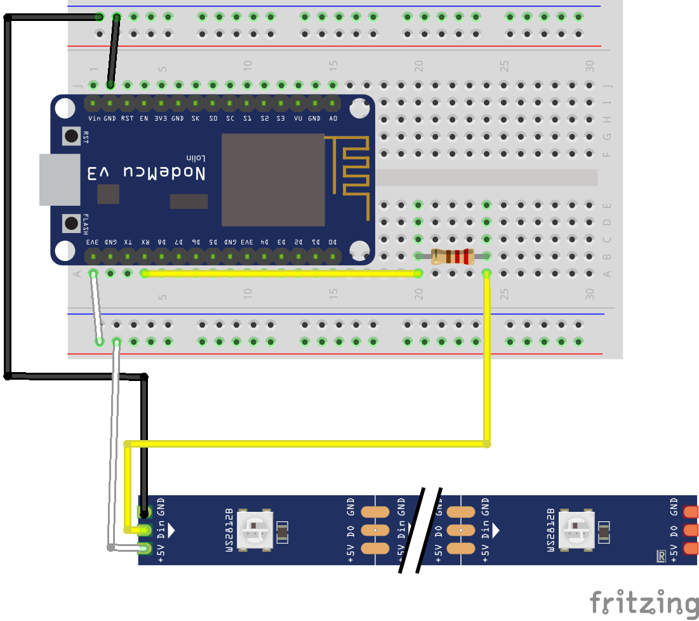

# LED Beispiele

Diese Beispielprogramme zeigen auf einfache Weise wie das Lichtband agesteuert werden kann

## LED Sample 1

## LED Sample 2

## Bauteile
Du benötigst
- NodeMCU Board
- Widerstand
- WS2812 LED Band mit mindestens 10 LED

## Schaltplan
Der Bauteile wie folgt verbinden: 
