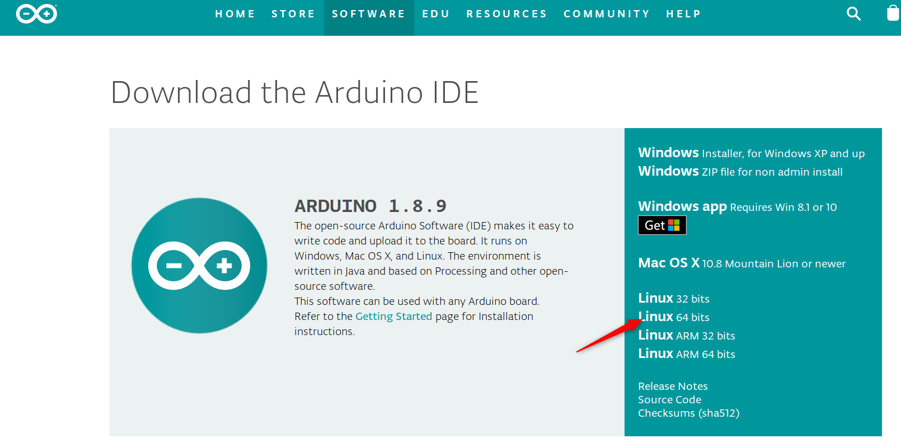
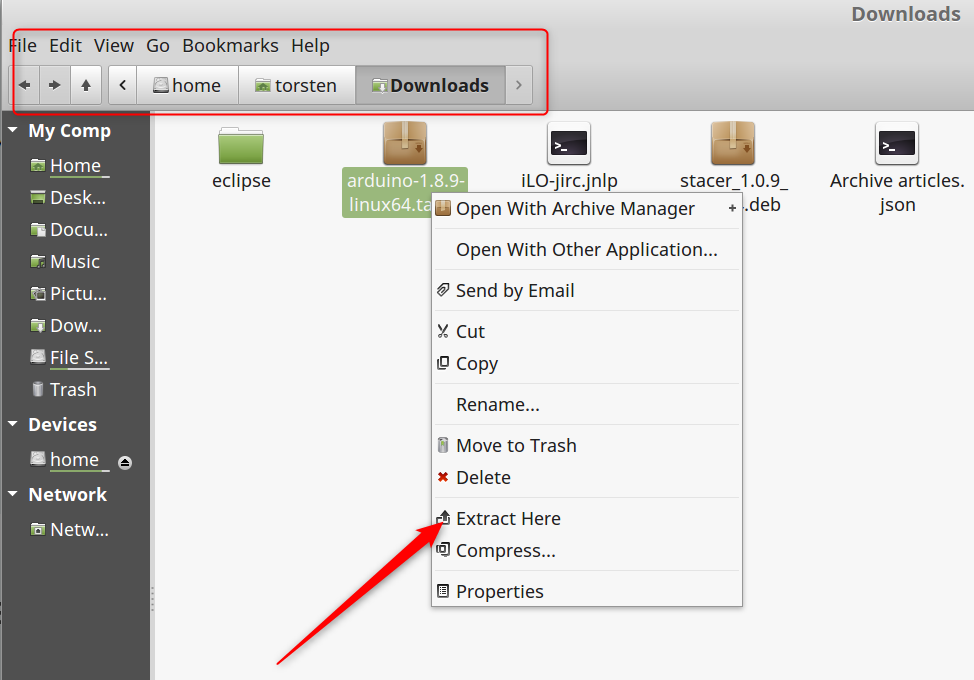
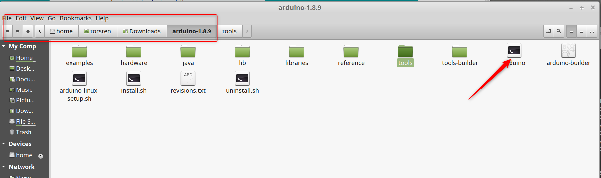
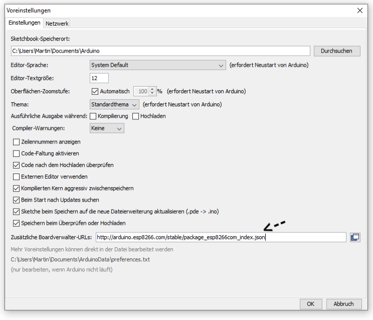
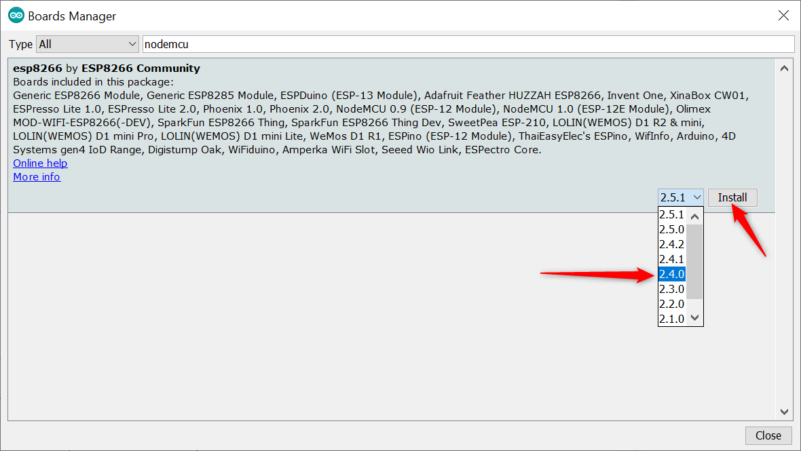
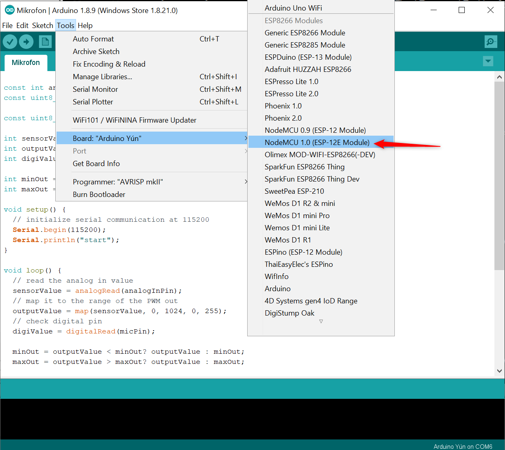
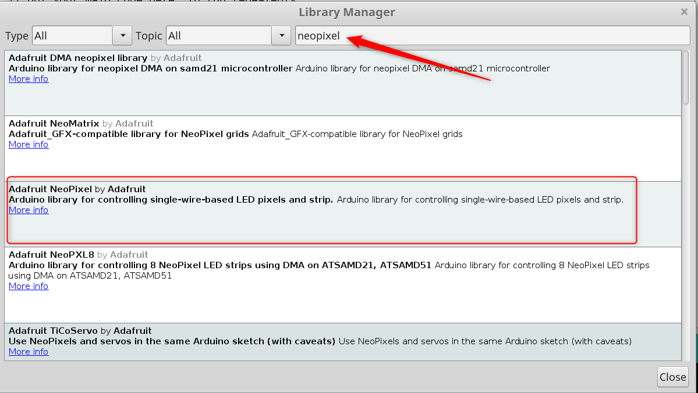

# Entwicklungsumgebung installieren/einrichten
## Arduino IDE installieren

### Windows

Beim Microsoft Store das machen. 

### Linux / Ubuntu

Von Arduino.cc die 64 Bit Linux Variante Laden:

Die Datei speichern. Nach dem Download den Downloadorder öffnen und das heruntergeladene Archiv auspacken:

Nun kann die Entwicklungsumgebung gestartet werden:

## Bibliotheken installieren

Für den Prozessor und die LED brauchen wir spezielle Bibliotheken.
Bei Arduino IDE findest du unter Datei die Voreinstellungen. Dort kopierst du folgende URL rein:

`http://arduino.esp8266.com/stable/package_esp8266com_index.json`

 

Unter Werkzeuge|Board findest du den Boardverwalter. In die Suchleiste gibst du nodemcu ein und installierst die Bibliothek mit der Version 2.4.0.

Nach der installation muss das Board ausgewählt werden. Unter Werkzeuge|Board Wählst du NodeMCU 1.0 aus.

Ausserdem benötigen wir eine Bibliothek um das LED Band zu beunutzen. Unter Menu Werkezuge|Bibliotheken muss die folgende Bibliothek installiert werden:

