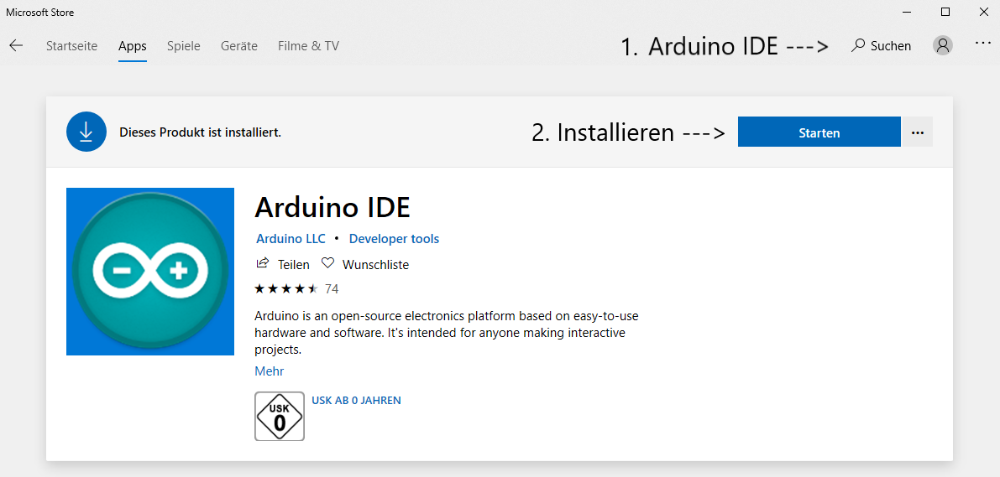

# Entwicklungsumgebung installieren/einrichten
## Arduino IDE installieren
Beim Microsoft Store das machen. 

## Bibliotheken installieren
Für den Prozessor brauchen wir eine spezielle Bibliothek.
Bei Arduino IDE findest du unter Datei die Voreinstellungen. Dort kopierst du folgende URL rein:
`http://arduino.esp8266.com/stable/package_esp8266com_index.json`
*Bild*
Unter Werkzeuge|Board findest du den Boardverwalter. In die Suchleiste gibst du nodemcu ein und installierst die Bibliothek mit der Version 2.4.0.
*Bild*
Nach der installation muss das Board ausgewählt werden. Unter Werkzeuge|Board Wählst du NodeMCU 1.0 aus.
